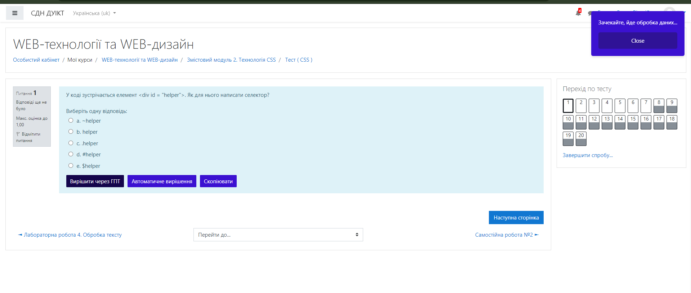
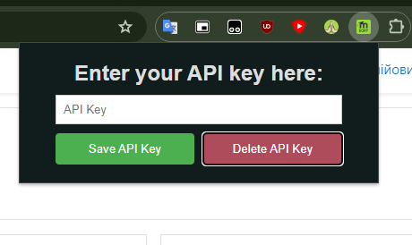

## Moodle Passer Extension 

This browser extension for Chrome and Firefox automates Moodle test-taking using AI technology. It interacts with Moodle's user interface to automatically select and submit answers, and to navigate through tests.

### Extension Features:

1. **Question Handling:** The extension reads question texts and answer options on Moodle pages.
2. **AI Integration:** It sends this data to a server where AI suggests probable correct answers.
3. **Automatic Answer Selection:** Answers are automatically selected based on AI suggestions.
4. **Test Navigation:** It manages moving to the next question after selecting answers.
5. **Question Text Copying** This feature allows users to quickly copy the text of a question and its answers.

### Popup:

The popup script provides an interface for managing the API key used for AI interactions:

### How to Build the Extension:

To build and install the extension in your browser, follow the instructions in [Extension_Builder.md](../Extension/Extension_Builder.md) located in the `Extension` folder.

